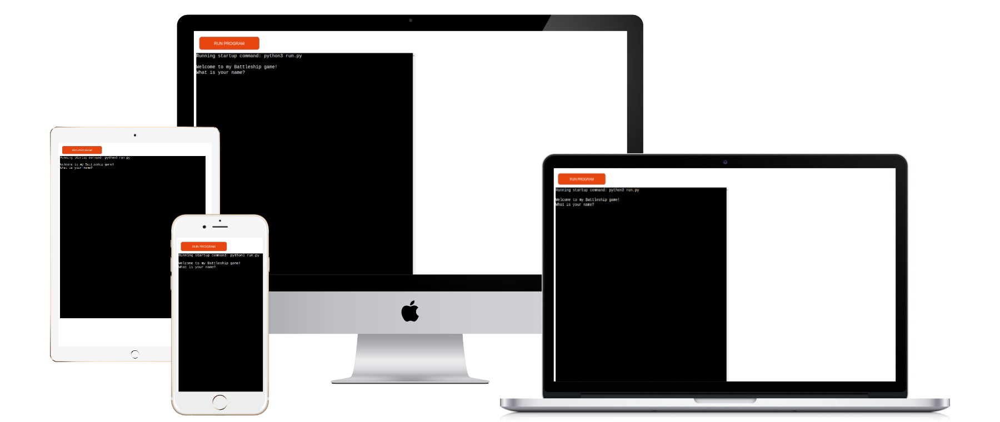
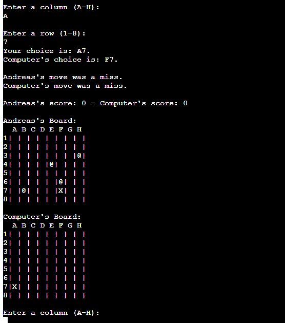
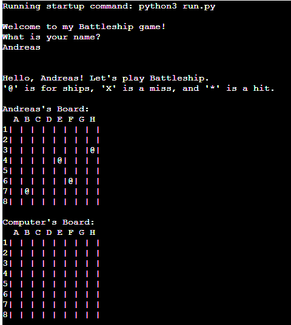
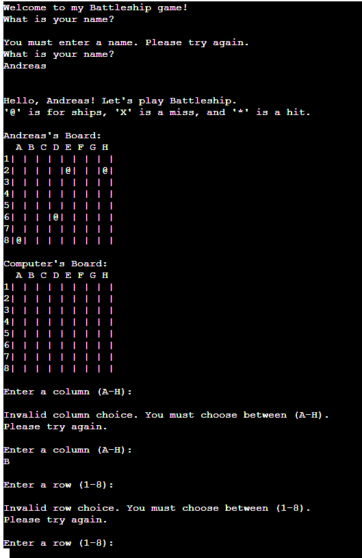
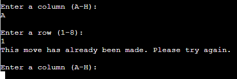
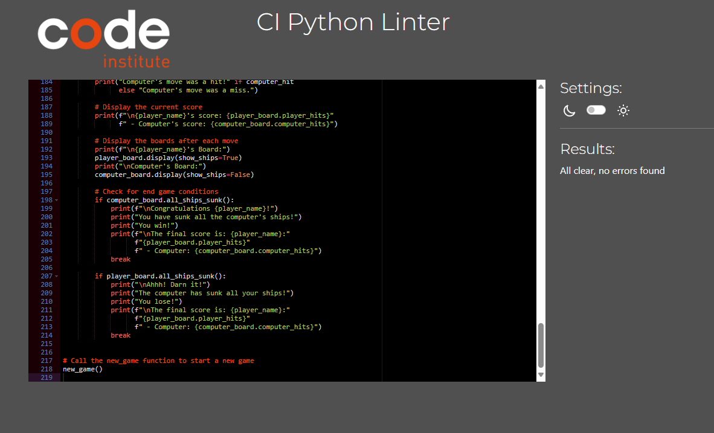

# Battleship Game

This is a Python terminal game, which runs on Heroku in the mock terminal from Code Intitute

The player must try to win the game, by finding all the computer's battleships before the computer finds theirs. 
Each battleship occupies one square on the board.

[The live link for the game can be found here.](https://battleship-project3-ape-9cb811461226.herokuapp.com/)

## How to play

My battleship game is based on the classic battleship game. [More information can be found here.](https://en.wikipedia.org/wiki/Battleship_(game)) 
In my version, the player enters their name and two boards are generated randomly containing 4 1*1 ships each. 
The player can see their ships, but not the computer's. The shign for the ships is @. 
Guesses by both the player and the computer are marked after each turn. X for misses and * for hits. 

 

The winner is the player who sinks all their opponent's battleships first.

## Features
### Current Features
- Random board generation
  - The code randomly generates ships for both the player and the computer.
  - The computer's ships are not visible

- The code accepts user input from the player.
- Randomly calculates a move for the computer.
- Makes sure that the computer cannot make the same move twice.
- Maintains the scores.
- Validates that the player doesn't leave the name input blank.
- Validates the player's input for the move they want to make.
- Checks that the player's input is the correct one (letter for the columns, number for the rows).

 

- Makes sure that the player cannot input the same move twice. 

### Future Features
- I would like to have ships larger than 1*1.
- I would like the ships to be randomly generated both verticaly or horizontaly.

## Data Model
I have used a Board class model following the example of Code Institute.
 
The Board class has a method to print both boards.
It has also methods to randomly generate and place the ships for both sides **place_ship**.
Methods to validate the player's guess **valid_cl**, **valid_rw**.
Also to validate if the players guesses are misses or hits **check_move** and to mark them on the **boards mark_move**.
Finally a method to check if all the ships of one side have been sunk **all_ships_sunk**. 

The **new_game** function uses the Board class and it's methods to run the game, and also displays text needed for the player to visualy follow the action. 
Also clears the terminal using the **clear_scr()** function, after the player makes a move choice, to keep the terminal decluttered.

## Testing
I have tested the code with the following actions:
- Passed the code through a PEP8 linter and found no problems.
- While coding used the PyLint extension in VS Code.
- Tested in my local terminal and the Code Institute Heroku terminal.
- Sent the link to the Code Institute Heroku terminal to friends and they also played the game.

### Bugs
**Solved Bugs**

- One of the bugs that I encountered was that when the player made a guess, the updated boards both showed the player's move only. 
I solved this by using different instances of the Board class, for the player and the computer.
- Another issue was the fact the the player when prompted could leave the name and column inputs blank. 
In the first case (name) the issue was mainly aesthetic as the players board was labeled **'s Board**,  
but on the second case (column) the code automatically chose as valid choice the first column always, so the input was A(number chosen). 
In both cases the issue was fixed by using the **strip()** method, which removes any leading or trailing whitespace. 
In the case of the name input a **while True** statement with an **if** condition made sure that the player's input cannot remain empty.

### Remaining Bugs
- There are no known bugs remaining.

### Validator Testing
- No errors are returned from https://pep8ci.herokuapp.com/ 

## Deployment
The project was delployed on Heroku using Code Intitute's mock terminal.

- Steps for deployment:
  - Make sure that a requirements.txt file has been created and is up to date with all the required dependencies, 
  by using the terminal command pip freeze  > requirements.txt in VS Code.
  - Create a new Heroku app.
  - Set the buildpacks to **Python** and **NodeJS** in that order.
  - Link the Heroku app to the repository.
  - Click on **Deploy**.

## Credits
- Code Institute for the Python mock terminal.
- [copyassignement.com](https://copyassignment.com/battleship-game-code-in-python/) for the idea of how the board should look like.
- My mentor Rory Patrick Sheridan, for catching the blank name and column input bugs.